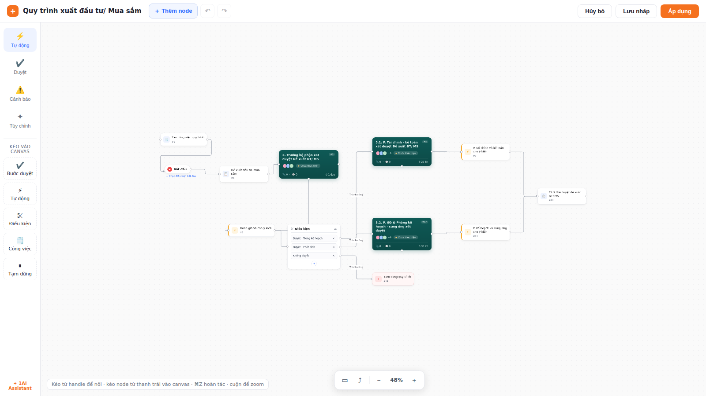

# Process builder example

A runnable approval-workflow / business-process builder built entirely on
RealFlow primitives — the kind of full-application screen the library does
**not** ship out of the box, assembled here as a reference implementation.

It recreates a "Quy trình xuất đầu tư/ Mua sắm" (investment/procurement
approval) editor: a Start node, task and approval cards, a **Condition node
that branches into several labelled outputs**, automation steps and a pause
step — with a left tool rail, a drag-to-canvas palette, a top action bar and
a bottom zoom control.



## Run

```bash
npm install            # once, from the repo root
npm run dev -w realflow-process-builder
# or, from the repo root:  npm run dev:process
```

Then open the printed Vite URL (default http://localhost:5173).

## What it demonstrates

| Area | RealFlow feature used |
| --- | --- |
| Custom node cards (title, `#code`, avatars, status pill, duration) | `nodeTypes` map + arbitrary JSX in `NodeProps` |
| Condition node that fans out to 3+ targets | multiple source `<Handle id=…>`, one per branch row |
| Branch edges labelled "Thành công" | `edge.label` + `sourceHandle` |
| Add / remove branches live | `useRealFlow().updateNodeData` + `removeEdges` |
| Top-bar undo / redo | store `history` topic → `undo()` / `redo()` |
| "Thêm node" + drag-from-palette | `screenToFlow` + `addNode`, HTML5 drag-and-drop |
| Bottom zoom read-out (`100%`) | store `viewport` topic + `zoomIn/zoomOut/fitView` |
| Áp dụng / Lưu nháp | `toSnapshot()` persisted to `localStorage` |
| Hủy bỏ | `loadSnapshot()` back to the initial state |
| Auto-arrange | `layout('layered', { direction: 'LR' })` |

## Files

| File | Role |
| --- | --- |
| `src/App.tsx` | App shell: top bar, left rail + palette, canvas, bottom view bar |
| `src/nodes.tsx` | Custom node components + `processNodeTypes` + palette items |
| `src/data.ts` | Initial process graph (nodes + labelled branch edges) |
| `src/process.css` | Styling that themes the RealFlow canvas to match the mockup |

## Note: interactive controls inside nodes

The canvas pane captures the pointer on `pointerdown` (default `panOnDrag`),
which otherwise swallows the click on a `<button>` rendered inside a node. Any
clickable control inside a node should therefore stop the event before it
reaches the pane:

```tsx
<button onPointerDown={(e) => e.stopPropagation()} onClick={handleClick}>…</button>
```

The Condition node's add / remove-branch buttons use exactly this pattern.
